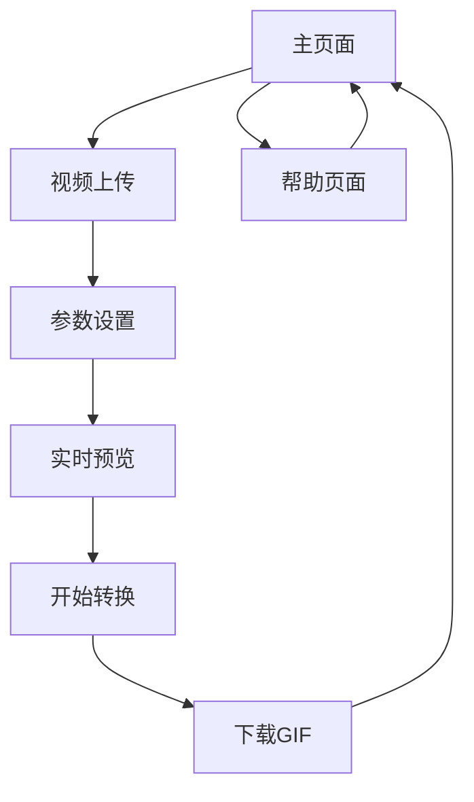

# 视频转GIF产品需求文档

## 1. Product Overview
一个基于Web的视频转GIF工具，允许用户上传视频文件并将其转换为高质量的GIF动图。
用户可以精确控制输出GIF的质量、尺寸和文件大小，满足不同场景下的使用需求。
该产品面向内容创作者、社交媒体用户和开发者，提供简单易用的视频转换服务。

## 2. Core Features

### 2.1 Feature Module
我们的视频转GIF应用包含以下主要页面：
1. **主页面**：视频上传区域、转换参数设置、预览区域、下载功能
2. **帮助页面**：使用说明、支持的格式、常见问题

### 2.2 Page Details

| Page Name | Module Name | Feature description |
|-----------|-------------|---------------------|
| 主页面 | 视频上传区域 | 支持拖拽上传和点击选择，支持MP4、AVI、MOV等常见视频格式，显示上传进度和文件信息 |
| 主页面 | 参数设置面板 | 质量控制（帧率1-30fps、颜色深度8-24bit）、尺寸控制（自定义宽高、保持比例、预设尺寸）、时间裁剪（开始时间、结束时间、持续时长） |
| 主页面 | 实时预览区域 | 显示原视频预览、转换后GIF预览、文件大小估算、转换进度条 |
| 主页面 | 转换和下载 | 开始转换按钮、转换状态显示、下载生成的GIF文件、重新转换选项 |
| 帮助页面 | 使用指南 | 详细的操作步骤说明、参数设置建议、最佳实践指导 |
| 帮助页面 | 技术支持 | 支持的视频格式列表、文件大小限制、常见问题解答 |

## 3. Core Process

用户操作流程：
1. 用户访问主页面，通过拖拽或点击上传视频文件
2. 系统验证文件格式和大小，显示视频基本信息和预览
3. 用户在参数设置面板中调整GIF质量、尺寸和时间范围
4. 实时预览区域显示参数调整后的效果和预估文件大小
5. 用户点击转换按钮，系统开始处理并显示进度
6. 转换完成后，用户可以预览最终GIF并下载文件
7. 用户可以重新调整参数或上传新视频继续使用

## 4. User Interface Design

### 4.1 Design Style
- 主色调：现代蓝色 (#2563eb) 和白色 (#ffffff)
- 辅助色：浅灰色 (#f8fafc) 和深灰色 (#64748b)
- 按钮样式：圆角矩形，渐变背景，悬停效果
- 字体：系统默认字体，标题18-24px，正文14-16px
- 布局风格：卡片式设计，左右分栏布局，响应式设计
- 图标风格：线性图标，简洁现代，统一风格

### 4.2 Page Design Overview

| Page Name | Module Name | UI Elements |
|-----------|-------------|-------------|
| 主页面 | 视频上传区域 | 虚线边框的拖拽区域，上传图标，"拖拽或点击上传"提示文字，支持格式说明 |
| 主页面 | 参数设置面板 | 分组的设置卡片，滑块控件，数值输入框，下拉选择器，实时参数显示 |
| 主页面 | 实时预览区域 | 并排的视频和GIF预览窗口，播放控制按钮，文件信息显示，进度条 |
| 主页面 | 转换下载区域 | 主要操作按钮（蓝色渐变），状态指示器，下载链接，重置按钮 |
| 帮助页面 | 内容区域 | 清晰的标题层级，代码块样式，表格展示，返回主页按钮 |

### 4.3 Responsiveness
产品采用桌面优先的响应式设计，在移动设备上自适应为单列布局，优化触摸交互体验。