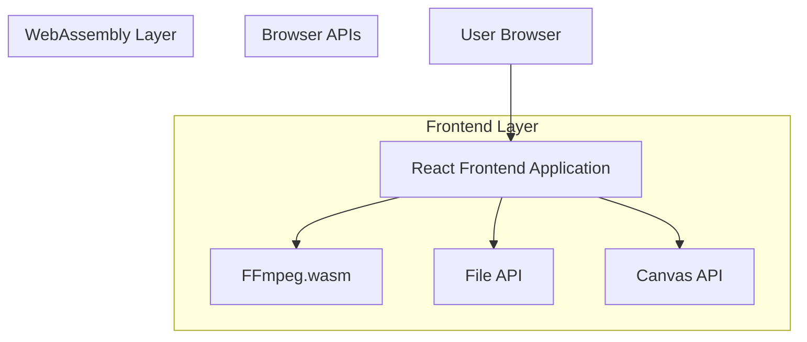
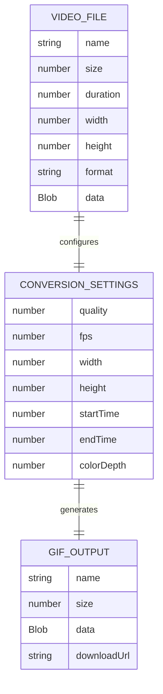
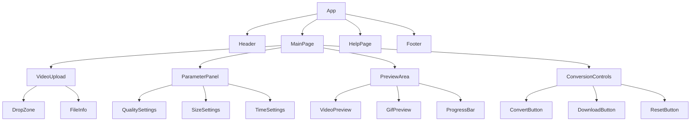

# 视频转GIF技术架构文档

## 1. Architecture design



## 2. Technology Description

- Frontend: React@18 + TypeScript + Tailwind CSS@3 + Vite
- Video Processing: FFmpeg.wasm (WebAssembly)
- File Handling: Browser File API
- Canvas Rendering: HTML5 Canvas API
- UI Components: Headless UI + Heroicons

## 3. Route definitions

| Route | Purpose |
|-------|----------|
| / | 主页面，包含视频上传、参数设置、预览和下载功能 |
| /help | 帮助页面，显示使用说明和技术支持信息 |

## 4. API definitions

### 4.1 Core API

由于采用纯前端架构，主要使用浏览器原生API和FFmpeg.wasm：

**文件上传处理**
```typescript
interface FileUploadHandler {
  handleFileSelect(file: File): Promise<VideoInfo>
  validateFile(file: File): boolean
}

interface VideoInfo {
  name: string
  size: number
  duration: number
  width: number
  height: number
  format: string
}
```

**GIF转换参数**
```typescript
interface GifConversionOptions {
  quality: number // 1-100
  fps: number // 1-30
  width?: number
  height?: number
  startTime: number // seconds
  endTime: number // seconds
  colorDepth: 8 | 16 | 24
}

interface ConversionResult {
  success: boolean
  gifBlob?: Blob
  error?: string
  fileSize: number
}
```

**转换进度回调**
```typescript
interface ProgressCallback {
  onProgress(progress: number): void // 0-100
  onComplete(result: ConversionResult): void
  onError(error: string): void
}
```

## 5. Data model

### 5.1 Data model definition

由于是纯前端应用，数据主要存储在浏览器内存和本地存储中：



### 5.2 Local Storage Schema

```typescript
// 用户偏好设置存储
interface UserPreferences {
  defaultQuality: number
  defaultFps: number
  preferredFormat: string
  lastUsedSettings: GifConversionOptions
}

// 转换历史记录（可选功能）
interface ConversionHistory {
  id: string
  timestamp: number
  originalFileName: string
  settings: GifConversionOptions
  outputSize: number
}
```

## 6. Component Architecture

### 6.1 组件层次结构



### 6.2 核心服务模块

```typescript
// FFmpeg服务
class FFmpegService {
  private ffmpeg: FFmpeg
  
  async initialize(): Promise<void>
  async convertToGif(videoFile: File, options: GifConversionOptions, onProgress: ProgressCallback): Promise<ConversionResult>
  async getVideoInfo(videoFile: File): Promise<VideoInfo>
}

// 文件处理服务
class FileService {
  validateVideoFile(file: File): boolean
  createDownloadUrl(blob: Blob, filename: string): string
  revokeDownloadUrl(url: string): void
  estimateGifSize(videoInfo: VideoInfo, options: GifConversionOptions): number
}

// 本地存储服务
class StorageService {
  saveUserPreferences(preferences: UserPreferences): void
  getUserPreferences(): UserPreferences | null
  addConversionHistory(record: ConversionHistory): void
  getConversionHistory(): ConversionHistory[]
}
```